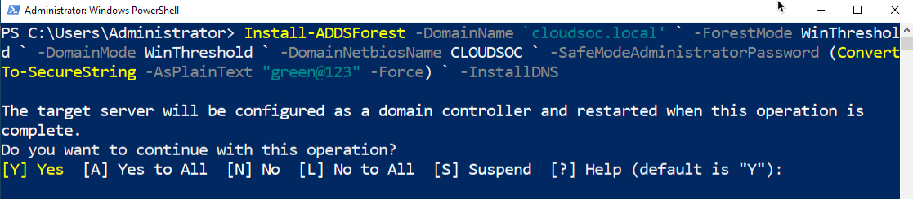

Installing and Configuring Active Directory Powershell
---

I have already written an article on: [Install Windows 2019 and Configure Active Directory in GUI](https://cloudsoc961429112.wordpress.com/windows-server/)(Graphical User Interface) based installation and configuration using server manager, I used it to add AD role and promote it. I will still be using a windows server 2019 with GUI, however I will do the install using just using powershell

So let's get started with configuring active directory in powershell, Let's log on to our server and right click on start and select powershell admin,

 I always pin powershell to my taskbar.

Lets set our IP address

 `` New-netIPAddress -IPAddress 192.168.95.20 -PrefixLength 24 -DefaultGateway 192.168.95.2 -InterfaceAlias Ethernet0 ``

 Now I will configure DNS server addresses and the command is: `` Set-DNSClientServerAddress -ServerAddresses 127.0.0.1 -InterfaceAlias Ethernet0 ``

Enter: `` ipconfig /all ``

You will see that the DNS Servers has been changed to 127.0.0.1

 Next command is to disable Internet Protocol Version 6 (TCP/IPv6)

 `` Disable-NetAdapterBinding -Name 'Ethernet0' -ComponentID 'ms_tcpip6' ``

Now enter `` ipconfig /all ``
again and you will see we have only IPv4 address.

Set up Remote Desktop powershell

`` Set-ItemProperty -Path 'HKLM:\System\CurrentControlSet\Control\Terminal Server'-name "fDenyTSConnections" -Value 0 ``

Example: Just to show you how its done in GUI we click the Disabled text which will open the System Properties window in the Remote tab.

From the System Properties window, we select “Allow remote connections to this Computer” as shown below.

Disable Internet Explorer Enhanced Security Configuration. It’s a security feature which is enabled by default in Windows Server 2019 When we try accessing any website, an error will pop-up which says the Enhanced Security Config has blocked the website, giving us an option to add the website to IE’s Trusted Zone. It's annoying so I disable it, not to mention Internet Explorer is outdated, I use other up to date browsers.

`` Set-ItemProperty -Path 'HKLM:\SOFTWARE\Microsoft\Active Setup\Installed Components\{A509B1A7-37EF-4b3f-8CFC-4F3A74704073}' -name IsInstalled -Value 0 ``

Set TimeZone: `` Tzutil.exe /s "Central Standard Time" ``

Now to rename our computer, I'm going to rename mine DC1:
`` Rename-Computer -NewName DC1 ``

`` Restart-computer ``

In Server Manager these are the changes we made so far

Now we will install the AD Domain Services feature and the associated management tools:

`` Install-WindowsFeature AD-Domain-Services -IncludeManagementTools ``

Install finished:

Note: Reboot is not required to complete the role service installations.

Now next step is to proceed with the configuration
Install ADDSForest

`` Install-ADDSForest -DomainName ‘cloudsoc.local’ `
-ForestMode WinThreshold `
-DomainMode WinThreshold `
-DomainNetbiosName CLOUDSOC `
-SafeModeAdministratorPassword (ConvertTo-SecureString -AsPlainText “green@123” -Force) `
-InstallDNS ``

This come up next just select Y

You will see warnings just as you did in the GUI. It may take about 5 min. and then you will see a blue screen telling you the system is going to auto reboot.

When the configuration completes it will auto reboot.

After reboot log back in. You will notice the login screen changed to our server

Now we will list the details about the active directory domain:

Now Run:
`` Get-ADDomain cloudsoc.local ``

Next let's add a reverse lookup zone:

`` Add-DnsServerPrimaryZone -NetworkID 192.168.95.0/24 -ZoneFile “95.168.192.in-addr.arpa.dns" -DynamicUpdate None -PassThru ``

Now lets add a pointer record:

`` Add-DNSServerResourceRecordPTR -ZoneName 95.168.192.in-addr.arpa -Name 20 -PTRDomainName dc1.cloudsoc.local ``

As you can see below , we have created a new reverse lookup zone and a pointer record.

And then we will set our Server Scavenging and Aging:

`` Set-DnsServerScavenging -ScavengingState $true -ScavengingInterval 7.00:00:00 -Verbose ``

And then zone aging

`` Set-DnsServerZoneAging cloudsoc.local -Aging $true -RefreshInterval 7.00:00:00 -NoRefreshInterval 7.00:00:00 -Verbose ``

zone aging reverse

`` Set-DnsServerZoneAging 95.168.192.in-addr.arpa -Aging $true -RefreshInterval 7.00:00:00 -NoRefreshInterval 7.00:00:00 -Verbose ``

`` Get-DnsServerScavenging ``

Let's set active directory sites and services:

`` New-ADReplicationSubnet -Name 192.168.95.0/24 -Site "Default-First-Site-Name" ``

Location of sites and services in GUI

In active directory users and computers let's create a new OrganizationalUnit and user:

Let's create the OrganizationalUnit name we want, I'll use Windows Admin.

`` New-ADOrganizationalUnit -Name "Windows Admin" ``

`` New-ADUser -Name "Jack Robinson" -GivenName "Jack" -Surname "Robinson" -SamAccountName "J.Robinson" -UserPrincipalName "J.Robinson@cloudsoc.local" -Path "OU=Windows Admin,DC=cloudsoc,DC=local" -AccountPassword(Read-Host -AsSecureString "Input Password") -Enabled $true  ``

Now let's get new user info:

`` Get-ADUser J.Robinson -Properties CanonicalName, Enabled, GivenName, Surname, Name, UserPrincipalName, samAccountName, whenCreated, PasswordLastSet  | Select CanonicalName, Enabled, GivenName, Surname, Name, UserPrincipalName, samAccountName, whenCreated, PasswordLastSet ``

Thats all for this article, I didn't go into a detail explanation, because i wanted to show how much faster it goes configuring server 2019 in powershell, however If you read the first article I posted on configuring active directory in GUI you will get a really good step by step explanation.  next I will post on how to use powershell to install and configure Windows core server.
